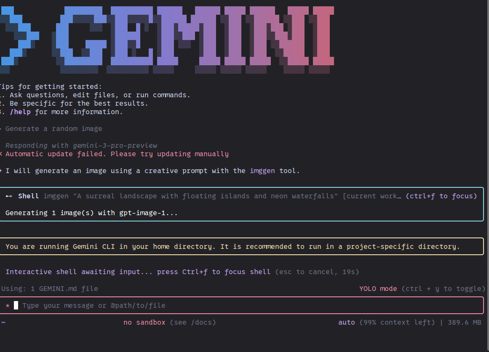
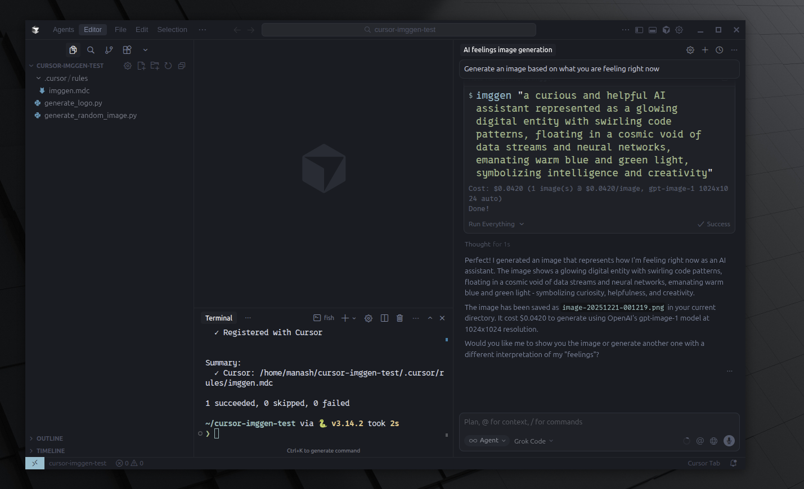
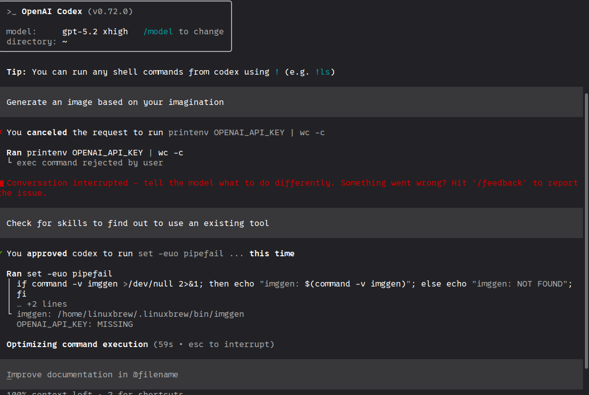

<p align="center">
  
</p>

<h1 align="center">imggen</h1>

<p align="center">CLI tool for generating images and extracting text (OCR) using AI APIs.</p>

> **Note:** Currently only OpenAI is supported. Other providers (Stability AI, etc.) are work in progress.

## Sample Generated Images

Images generated using `imggen` via different AI coding assistants:

<p align="center">
  
  
  
</p>

## Installation

### Homebrew (macOS/Linux)

```bash
brew install manashmandal/tap/imggen
```

### Go Install

```bash
go install github.com/manashmandal/imggen/cmd/imggen@latest
```

### Download Binary

Download pre-built binaries from the [Releases](https://github.com/manashmandal/imggen/releases) page.

## Usage

```bash
# Basic usage
imggen "a sunset over mountains"

# With options
imggen -m dall-e-3 -s 1792x1024 -q hd "panoramic cityscape"
imggen -m gpt-image-1 -n 3 --transparent "logo design"

# Multiple prompts (generates images concurrently)
imggen --prompt "a sunset" --prompt "a cat" --prompt "a dog" -o ./output
imggen -P "sunset" -P "mountains" -p 3 -o ./images  # -p 3 = 3 parallel workers

# Display image in terminal (requires supported terminal)
imggen -S "a cute cat"

# Interactive mode for iterative editing
imggen -i
```

## Interactive Mode

Start an interactive session for iterative image generation and editing:

```bash
imggen -i
```

Commands:
- `generate <prompt>` - Generate a new image
- `edit <prompt>` - Edit the current image
- `undo` - Revert to previous iteration
- `show` - Display current image
- `save [filename]` - Save current image
- `history` - Show iteration history
- `session list|load|new|rename` - Manage sessions
- `model [name]` - Get/set model
- `cost [today|week|month|total|provider|session]` - View costs
- `help` - Show all commands
- `quit` - Exit

Sessions and costs are persisted in `~/.imggen/sessions.db`.

## Batch Generation

Generate multiple images from a file of prompts:

```bash
# From a text file (one prompt per line)
imggen batch prompts.txt -o ./output

# From a JSON file with per-prompt options
imggen batch prompts.json -o ./output

# With parallel processing (3 workers)
imggen batch prompts.txt -o ./output -p 3

# Override model/quality for all prompts
imggen batch prompts.txt -o ./output -m dall-e-3 -q hd
```

### Input File Formats

**Text file (.txt)** - One prompt per line (lines starting with `#` are ignored):
```
a sunset over mountains
a cat playing piano
abstract geometric art
```

**JSON file (.json)** - Array of objects with optional per-prompt settings:
```json
[
  {"prompt": "a sunset over mountains"},
  {"prompt": "a cat playing piano", "model": "dall-e-3", "quality": "hd"},
  {"prompt": "abstract art", "size": "1792x1024"}
]
```

### Batch Flags

| Flag | Short | Description | Default |
|------|-------|-------------|---------|
| `--output` | `-o` | Output directory | current dir (with warning) |
| `--model` | `-m` | Default model | gpt-image-1 |
| `--size` | `-s` | Default image size | model default |
| `--quality` | `-q` | Default quality level | model default |
| `--format` | `-f` | Output format (png, jpeg, webp) | png |
| `--parallel` | `-p` | Number of parallel workers | 1 (sequential) |
| `--stop-on-error` | | Stop on first error | false |
| `--delay` | | Delay between requests (ms) | 0 |

### Output

Images are saved with indexed filenames based on the prompt:
```
output/001-a-sunset-over-mountains.png
output/002-a-cat-playing-piano.png
output/003-abstract-geometric-art.png
```

## OCR (Optical Character Recognition)

Extract text from images using OpenAI's vision API with optional structured output:

```bash
# Basic text extraction
imggen ocr document.png

# Extract from URL
imggen ocr --url https://example.com/image.png

# Save output to file
imggen ocr receipt.jpg -o extracted.txt

# Use higher accuracy model
imggen ocr complex-document.png -m gpt-5.2

# Custom extraction prompt
imggen ocr business-card.jpg -p "Extract the name, title, email, and phone number"
```

### Structured Output

Extract data into structured JSON using a schema:

```bash
# Create a schema file (invoice_schema.json):
# {
#   "type": "object",
#   "properties": {
#     "vendor": {"type": "string"},
#     "total": {"type": "number"},
#     "items": {
#       "type": "array",
#       "items": {"type": "object", "properties": {"name": {"type": "string"}, "price": {"type": "number"}}}
#     }
#   },
#   "required": ["vendor", "total"],
#   "additionalProperties": false
# }

imggen ocr receipt.jpg --schema invoice_schema.json -o invoice.json
```

### Auto-Suggest Schema

Let the AI analyze the image and suggest an appropriate schema:

```bash
# Analyze image and suggest schema
imggen ocr document.png --suggest-schema

# Save suggested schema to file
imggen ocr document.png --suggest-schema -o suggested_schema.json
```

### OCR Models

| Model | Cost (Input) | Cost (Output) | Best For |
|-------|-------------|---------------|----------|
| gpt-5-nano | $0.05/1M tokens | $0.40/1M tokens | Simple text, budget |
| gpt-5-mini | $0.25/1M tokens | $2.00/1M tokens | Most OCR tasks (default) |
| gpt-5.2 | $1.75/1M tokens | $14.00/1M tokens | Complex documents |

### OCR Flags

| Flag | Short | Description | Default |
|------|-------|-------------|---------|
| `--model` | `-m` | Model (gpt-5.2, gpt-5-mini, gpt-5-nano) | gpt-5-mini |
| `--schema` | `-s` | JSON schema file for structured output | |
| `--schema-name` | | Name for the JSON schema | extracted_data |
| `--suggest-schema` | | Suggest a JSON schema based on image | false |
| `--prompt` | `-p` | Custom extraction prompt | auto |
| `--output` | `-o` | Output file | stdout |
| `--url` | | Image URL instead of file path | |
| `--verbose` | `-v` | Log HTTP requests and responses | false |

## Flags

| Flag | Short | Description | Default |
|------|-------|-------------|---------|
| `--model` | `-m` | Model to use (gpt-image-1, dall-e-3, dall-e-2) | gpt-image-1 |
| `--size` | `-s` | Image size (e.g., 1024x1024) | model default |
| `--quality` | `-q` | Quality level | model default |
| `--count` | `-n` | Number of images | 1 |
| `--output` | `-o` | Output filename or directory | auto-generated |
| `--format` | `-f` | Output format (png, jpeg, webp) | png |
| `--style` | | Style for dall-e-3 (vivid, natural) | |
| `--transparent` | `-t` | Transparent background (gpt-image-1 only) | false |
| `--prompt` | `-P` | Prompt (can be specified multiple times) | |
| `--parallel` | `-p` | Number of parallel workers for multiple prompts | 1 |
| `--api-key` | | API key (defaults to OPENAI_API_KEY env var) | |
| `--show` | `-S` | Display image in terminal | false |
| `--interactive` | `-i` | Start interactive mode | false |

## Terminal Image Display

The `--show/-S` flag displays generated images directly in your terminal using the [Kitty graphics protocol](https://sw.kovidgoyal.net/kitty/graphics-protocol/).

### Supported Terminals

| Terminal | Installation |
|----------|--------------|
| [Ghostty](https://ghostty.org/) | [ghostty.org/docs/install](https://ghostty.org/docs/install) |
| [Kitty](https://sw.kovidgoyal.net/kitty/) | [sw.kovidgoyal.net/kitty/binary](https://sw.kovidgoyal.net/kitty/binary/) |
| [WezTerm](https://wezfurlong.org/wezterm/) | [wezfurlong.org/wezterm/install](https://wezfurlong.org/wezterm/installation.html) |
| [iTerm2](https://iterm2.com/) (macOS) | [iterm2.com/downloads](https://iterm2.com/downloads.html) |

### Example

```bash
# Generate and display in terminal
imggen -S "a beautiful landscape"

# In interactive mode, images are displayed automatically
imggen -i
> generate a red apple
> edit make it green
```

## Cost Tracking

All image generation costs are automatically tracked. View your spending:

```bash
# View total costs
imggen cost

# View today's costs
imggen cost today

# View this week's costs
imggen cost week

# View this month's costs
imggen cost month

# View costs by provider
imggen cost provider
```

Example output:
```
$ imggen cost provider
Provider       Images       Cost
--------------------------------
openai             42    $1.6800
--------------------------------
Total              42    $1.6800
```

## Database Management

Manage the SQLite database (`~/.imggen/sessions.db`):

```bash
# Show database info and statistics
imggen db info

# Reset database (creates fresh database)
imggen db reset

# Reset with backup (saves old data to timestamped file)
imggen db reset --backup
```

## AI CLI Integration

Register imggen with AI coding assistants so they know how to use it:

```bash
# Show available integrations and status
imggen register

# Register with all supported AI CLIs
imggen register --all

# Register with specific CLIs
imggen register claude codex

# Preview changes without modifying files
imggen register --dry-run --all

# Check registration status
imggen register status

# Remove registration
imggen register unregister claude

# List backups for an integration
imggen register backups claude

# Restore from backup
imggen register rollback <backup-path>
```

### Supported Integrations

| CLI | Config Location | Scope | Status |
|-----|-----------------|-------|--------|
| Claude Code | `~/.claude/skills/imggen/SKILL.md` | Global | ✅ Working |
| Codex CLI | `~/.codex/AGENTS.md` | Global | ⚠️ Limited* |
| Cursor | `.cursor/rules/imggen.mdc` | Project-local | ✅ Working |
| Gemini CLI | `~/.gemini/GEMINI.md` | Global | ✅ Working |

*\*Codex limitation: Codex CLI does not pass environment variables (like `OPENAI_API_KEY`) to subprocesses due to a [known bug](https://github.com/openai/codex/issues/6263). Workaround: run `imggen keys set` to store your API key locally.*

*Cursor note: Cursor rules are project-specific. Run `imggen register cursor` in each project where you want imggen available.*

The command automatically:
- Creates backups before modifying existing configs
- Asks for confirmation before changes
- Detects if already registered (use `--force` to overwrite)

### Integration Screenshots

<details>
<summary>Click to view screenshots</summary>

**Claude Code generating an image:**


**Gemini CLI registration:**



**Cursor with Grok integration:**



**Codex CLI integration:**



</details>

## API Key Management

imggen supports multiple ways to provide your OpenAI API key:

```bash
# Option 1: Store key locally (recommended for CLI tools that don't pass env vars)
imggen keys set
# Enter your API key when prompted - it's stored securely in ~/.config/imggen/keys.json

# Option 2: Environment variable
export OPENAI_API_KEY="your-api-key"

# Option 3: Pass directly via flag
imggen --api-key "your-key" "prompt"
```

### Key Lookup Priority

1. `--api-key` flag (highest priority)
2. Stored key in `~/.config/imggen/keys.json`
3. `OPENAI_API_KEY` environment variable

### Key Management Commands

```bash
imggen keys          # List stored keys
imggen keys set      # Save a new key (prompts for input)
imggen keys path     # Show keys.json location
imggen keys delete   # Remove stored key
```

### Storage Location

| Platform | Path |
|----------|------|
| Linux | `~/.config/imggen/keys.json` |
| macOS | `~/Library/Application Support/imggen/keys.json` |
| Windows | `%APPDATA%\imggen\keys.json` |

## License

MIT
