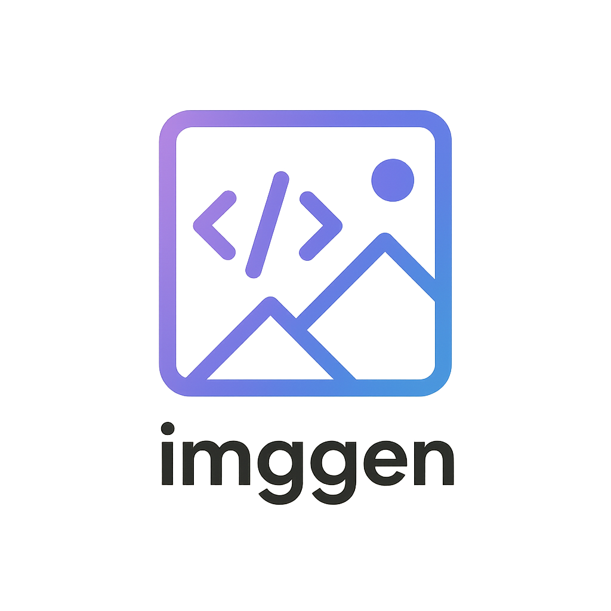

<p align="center">
  
</p>

<h1 align="center">imggen</h1>

<p align="center">CLI tool for generating images using AI image generation APIs.</p>

## Installation

### Homebrew (macOS/Linux)

```bash
brew tap manashmandal/tap
brew install imggen
```

### Go Install

```bash
go install github.com/manashmandal/imggen/cmd/imggen@latest
```

### Download Binary

Download pre-built binaries from the [Releases](https://github.com/manashmandal/imggen/releases) page.

## Usage

```bash
# Basic usage
imggen "a sunset over mountains"

# With options
imggen -m dall-e-3 -s 1792x1024 -q hd "panoramic cityscape"
imggen -m gpt-image-1 -n 3 --transparent "logo design"

# Display image in terminal (requires supported terminal)
imggen -S "a cute cat"

# Interactive mode for iterative editing
imggen -i
```

## Interactive Mode

Start an interactive session for iterative image generation and editing:

```bash
imggen -i
```

Commands:
- `generate <prompt>` - Generate a new image
- `edit <prompt>` - Edit the current image
- `undo` - Revert to previous iteration
- `show` - Display current image
- `save [filename]` - Save current image
- `history` - Show iteration history
- `session list|load|new|rename` - Manage sessions
- `model [name]` - Get/set model
- `help` - Show all commands
- `quit` - Exit

Sessions are persisted in `~/.imggen/sessions.db` with full history.

## Flags

| Flag | Short | Description | Default |
|------|-------|-------------|---------|
| `--model` | `-m` | Model to use (gpt-image-1, dall-e-3, dall-e-2) | gpt-image-1 |
| `--size` | `-s` | Image size (e.g., 1024x1024) | model default |
| `--quality` | `-q` | Quality level | model default |
| `--count` | `-n` | Number of images | 1 |
| `--output` | `-o` | Output filename | auto-generated |
| `--format` | `-f` | Output format (png, jpeg, webp) | png |
| `--style` | | Style for dall-e-3 (vivid, natural) | |
| `--transparent` | `-t` | Transparent background (gpt-image-1 only) | false |
| `--api-key` | | API key (defaults to OPENAI_API_KEY env var) | |
| `--show` | `-S` | Display image in terminal | false |
| `--interactive` | `-i` | Start interactive mode | false |

## Terminal Image Display

The `--show/-S` flag displays generated images directly in your terminal using the [Kitty graphics protocol](https://sw.kovidgoyal.net/kitty/graphics-protocol/).

### Supported Terminals

| Terminal | Installation |
|----------|--------------|
| [Ghostty](https://ghostty.org/) | [ghostty.org/docs/install](https://ghostty.org/docs/install) |
| [Kitty](https://sw.kovidgoyal.net/kitty/) | [sw.kovidgoyal.net/kitty/binary](https://sw.kovidgoyal.net/kitty/binary/) |
| [WezTerm](https://wezfurlong.org/wezterm/) | [wezfurlong.org/wezterm/install](https://wezfurlong.org/wezterm/installation.html) |
| [iTerm2](https://iterm2.com/) (macOS) | [iterm2.com/downloads](https://iterm2.com/downloads.html) |

### Example

```bash
# Generate and display in terminal
imggen -S "a beautiful landscape"

# In interactive mode, images are displayed automatically
imggen -i
> generate a red apple
> edit make it green
```

## Environment Variables

```bash
export OPENAI_API_KEY="your-api-key"
```

## License

MIT
